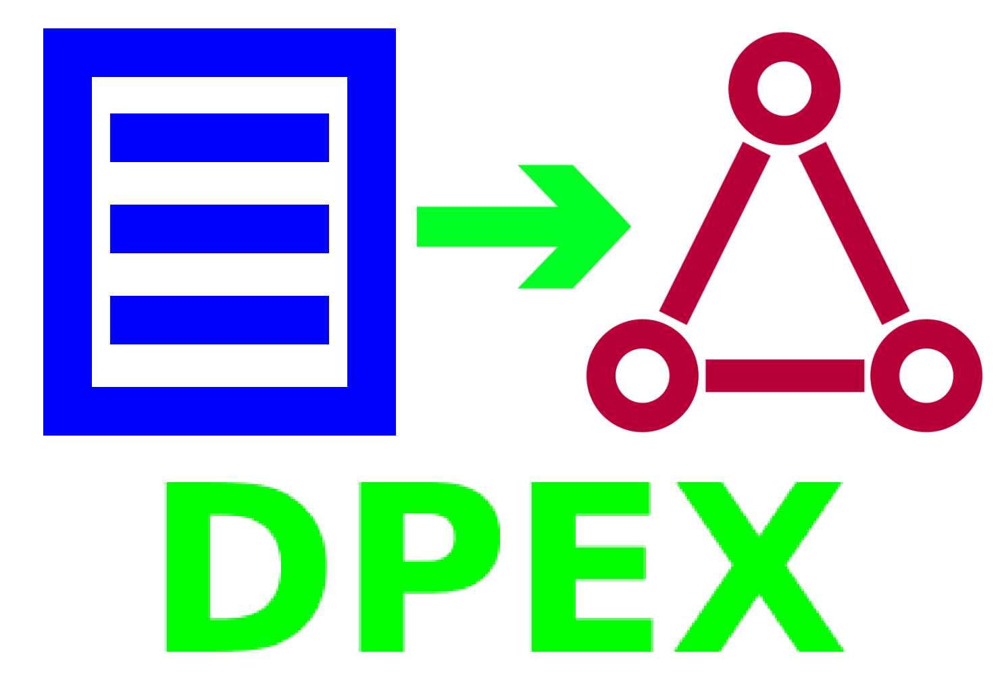

## Entity Extraction Service
Entity extraction API powered by DeepPavlov configs.




## Run with docker-compose
`docker-compose up --build`


## How to
Main gateway (with Swagger UI) is available at http://localhost:9999/


#### POST `/model`
```json
{
  "text": [
    "what is the capital of Great Britain?"
  ]
}
```

#### RESPONSE
<details>

<summary>Show full response</summary>

```json
[
  [
    {
      "entities_info": {
        "Great Britain": {
          "conf": 0.14,
          "entity_label": "Great Britain",
          "inception": [
            [
              "\"+1707-05-01^^T\"",
              "01 May 1707"
            ]
          ],
          "instance of": [
            [
              "Q3024240",
              "historical country"
            ],
            [
              "Q3624078",
              "sovereign state"
            ],
            [
              "Q417175",
              "kingdom"
            ]
          ],
          "participant in": [
            [
              "Q3024756",
              "Battle of Porto Bello"
            ],
            [
              "Q677929",
              "Battle of Toulon"
            ],
            [
              "Q944941",
              "Irish Rebellion of 1798"
            ]
          ],
          "plain_entity": "Q161885",
          "pos": 0,
          "token_conf": 1,
          "types_2hop": [
            [
              "Q19953632",
              "former administrative territorial entity"
            ],
            [
              "Q3024240",
              "historical country"
            ],
            [
              "Q7275",
              "state"
            ],
            [
              "Q417175",
              "kingdom"
            ],
            [
              "Q3624078",
              "sovereign state"
            ],
            [
              "Q7269",
              "monarchy"
            ],
            [
              "Q96196009",
              "state (former and current)"
            ],
            [
              "Q1250464",
              "realm"
            ],
            [
              "Q6256",
              "country"
            ]
          ]
        },
        "capital": {
          "conf": 0.15,
          "entity_label": "Le Capital",
          "genre": [
            [
              "Q130232",
              "drama"
            ]
          ],
          "instance of": [
            [
              "Q11424",
              "film"
            ]
          ],
          "narrative location": [
            [
              "Q60",
              "New York City"
            ],
            [
              "Q84",
              "London"
            ],
            [
              "Q90",
              "Paris"
            ]
          ],
          "plain_entity": "Q3220821",
          "pos": 0,
          "publication date": [
            [
              "\"+2012-11-14^^T\"",
              "14 November 2012"
            ],
            [
              "\"+2013-08-08^^T\"",
              "08 August 2013"
            ],
            [
              "\"+2015-01-08^^T\"",
              "08 January 2015"
            ]
          ],
          "token_conf": 1,
          "types_2hop": [
            [
              "Q2431196",
              "audiovisual work"
            ],
            [
              "Q11424",
              "film"
            ],
            [
              "Q4502142",
              "visual artwork"
            ],
            [
              "Q20937557",
              "series"
            ],
            [
              "Q10301427",
              "moving image"
            ]
          ]
        }
      },
      "topic_skill_entities_info": {
        "Great Britain": {
          "age": 356,
          "conf": 0.23,
          "country of sitizenship": [
            [
              "Q161885",
              "Great Britain"
            ]
          ],
          "date of birth": [
            [
              "\"+1665-02-06^^T\"",
              "06 February 1665"
            ]
          ],
          "entity_label": "Anne of Great Britain",
          "instance of": [
            [
              "Q5",
              "human"
            ]
          ],
          "occupation": [
            [
              "Q82955",
              "politician"
            ]
          ],
          "plain_entity": "Q119702",
          "pos": 3,
          "spouse": [
            [
              "Q317499",
              "Prince George of Denmark"
            ]
          ],
          "token_conf": 1,
          "types_2hop": [
            [
              "Q28640",
              "profession"
            ],
            [
              "Q82955",
              "politician"
            ],
            [
              "Q5",
              "human"
            ],
            [
              "Q702269",
              "professional"
            ]
          ]
        },
        "capital": {
          "conf": 0.15,
          "entity_label": "Le Capital",
          "genre": [
            [
              "Q130232",
              "drama"
            ]
          ],
          "instance of": [
            [
              "Q11424",
              "film"
            ]
          ],
          "narrative location": [
            [
              "Q60",
              "New York City"
            ],
            [
              "Q84",
              "London"
            ],
            [
              "Q90",
              "Paris"
            ]
          ],
          "plain_entity": "Q3220821",
          "pos": 0,
          "publication date": [
            [
              "\"+2012-11-14^^T\"",
              "14 November 2012"
            ],
            [
              "\"+2013-08-08^^T\"",
              "08 August 2013"
            ],
            [
              "\"+2015-01-08^^T\"",
              "08 January 2015"
            ]
          ],
          "token_conf": 1,
          "types_2hop": [
            [
              "Q2431196",
              "audiovisual work"
            ],
            [
              "Q11424",
              "film"
            ],
            [
              "Q4502142",
              "visual artwork"
            ],
            [
              "Q20937557",
              "series"
            ],
            [
              "Q10301427",
              "moving image"
            ]
          ]
        }
      },
      "utt_num": 0
    }
  ]
]
```

</details>
